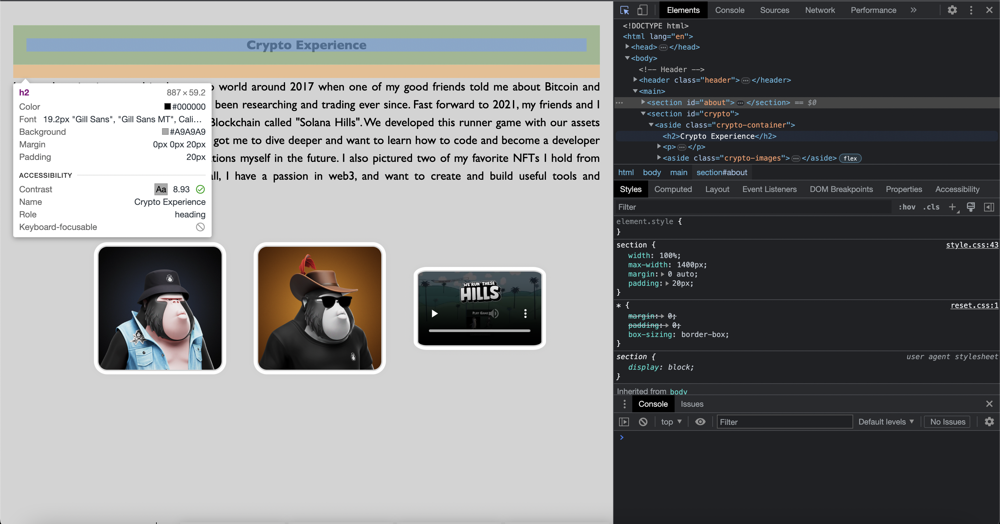
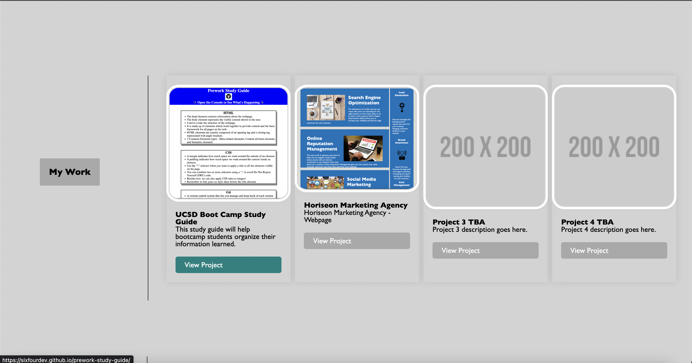

# Shane Browning's Profolio

## Description

Welcome to Shane's Portfolio Webpage! My motivation in creating this webpage was to create my firt webpage with no help, and use the skills I've learned the first couple weeks at the UCSD Extended Studies Bootcamp. The reason I built this webpage was to provide a brief description about myself, what I am passionate about, a showcase from previous projects, and ways to connect with me. The first section of the webpage shows a little about myself, and some of my goals in the future! The second section also shows some of my Crypto Experience, like creating a runner game in web3 with some of my friends. The third section, showcases some of my past projects that I've worked on (will add to the TBA). Lastly, the fourth section includes a contact section in ways to contact me!

## Table of Contents

- About Me
- Crypto Experience
- My Work
- Contact Me

## Usage

The goal of this webpage is to learn a little about Shane Browning. The webpage is split up into four different sections which includes an About Me, Crypto Experience, My Work, and a Contact Section. If you open the Chrome DevTools by pressing Command+Option+I (MacOS) or Control+Shift+I (Windows), a console panel should open either below or to the side of the webpage in the browser. If you click the first button on the top left of DevTools (arrow with a box), you can hover over elements on the page to inspect it. You can see that the webpage has great contrast accessibility, uses semantic HTML elements, which helps with assistive technologies. If you click on any of the sections in the Navigation Bar, it will scroll to the appropriate section on the webpage. You could also click on "View Project" in the My Work section in the separate projects to link you to those said projects!

## Credits

Shane Browning - github.com/SixFourDev

## License

MIT License